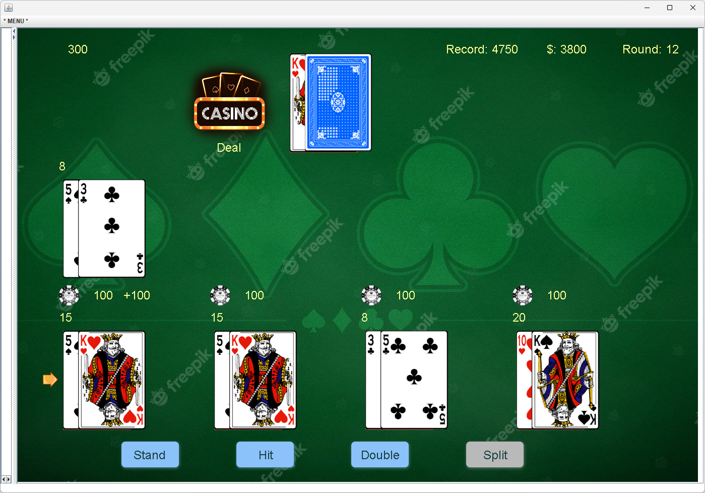

# Black Jack 
## Introduction:
This is a personal project driven purely by interest.  
Blackjack is a classic casino game, and you can find the game introduction in the link below:  
[Black Jack Game Rules](https://bicyclecards.com/how-to-play/blackjack/)  
I developed the double and split options, allowing players to control four hands simultaneously, adding to the challenge. Players can maximize their profits through mathematical calculations. The game also features local saving of user archives, recording user balances, highest scores, and the number of rounds played. The game is set with 6 decks, which reset when the deck drops below 52 cards or when the user restarts the game. **Clicking on the Casino logo deals the cards**.  

The graphical interface development was facilitated using the basic instructional library provided by the school, known as ecs100.jar. This library offers a canvas for drawing graphics, images, and text strings. Additionally, it provides functionality for responding to mouse events. Leveraging these features, I manually implemented a range of underlying GUI functionalities including element layout, button clicks, screen refresh, game loops, message Prompt and more.

Find the executable application (black_jack.exe) from Google Drive:  
[Edmond's Java Program Collection.zip (Windows)](https://drive.google.com/drive/folders/1ovLlyHeENMtQDsT5b9hJBcHwKPCrC6Mg?usp=sharing)  
Have fun!
## Snapshot
 

## Tech Stack 
| Type | Name |
| ----------- | ----------- 
| Programming Language | Java |
| GUI Library | ecs100.jar |

## Run Instruction
### Requirement:
- Java Runtime Environment

### Steps:   
To run the source code in development environment, please follow the steps below:
1. Clone the repository from the GitHub
2. Add ecs100.jar to Build Path
3. Run the *BlackJack_Main.java* in the default package.

## License
MIT